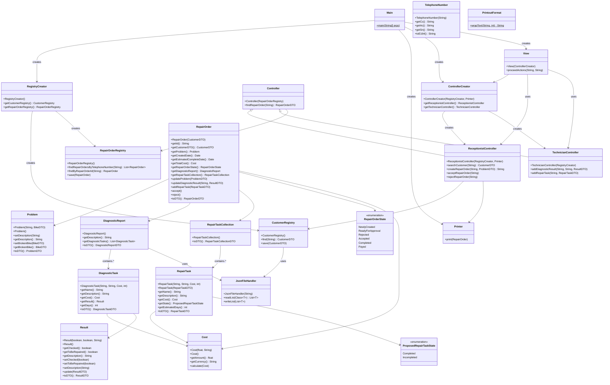
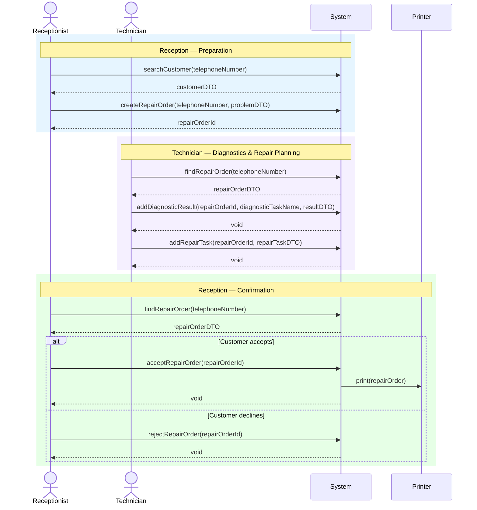
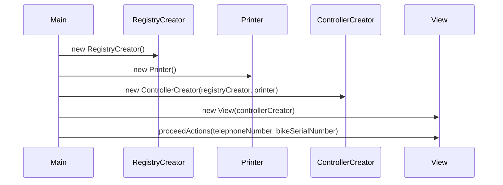
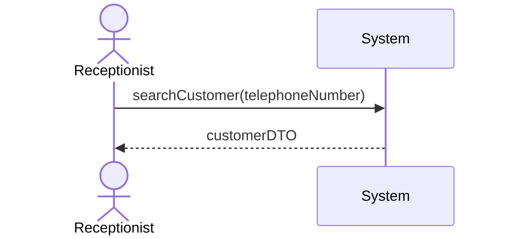
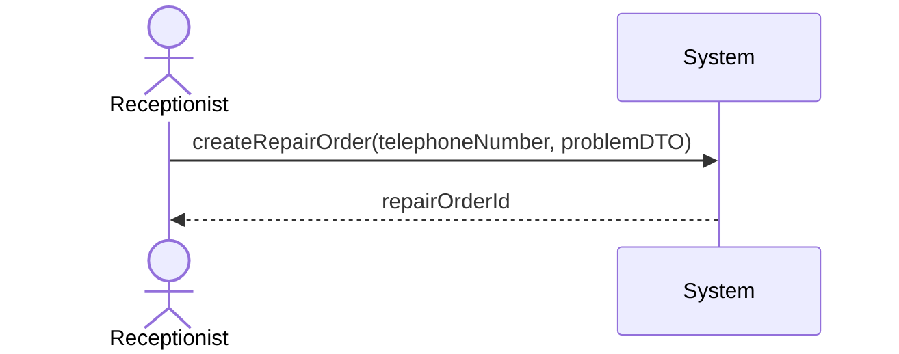
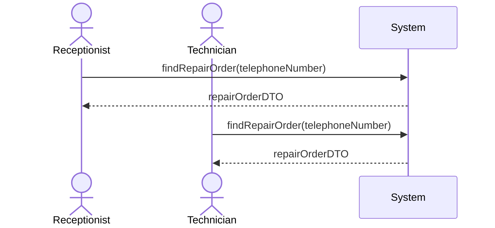
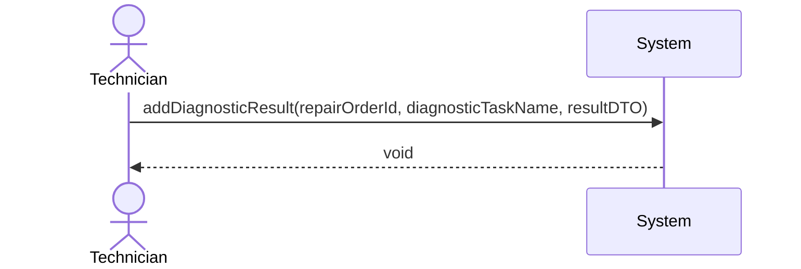
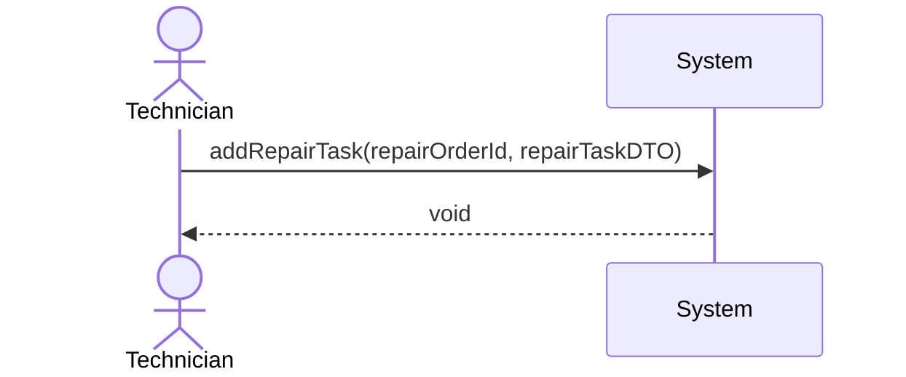
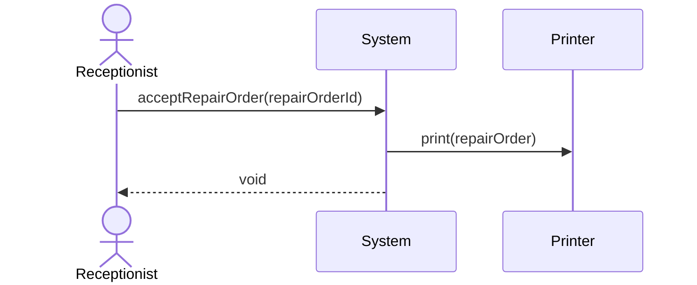
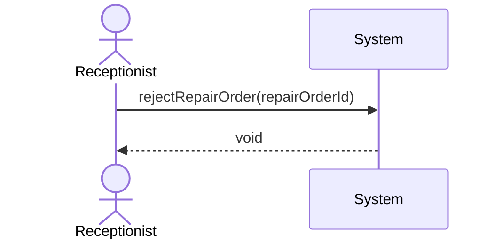

# Electric Bike Repair System

## Introduction

ElectricBikeRepair System is a Java application that simulates the repair workflow for an electric bike repair shop. It models the end-to-end process from customer reception through technician diagnostics to repair order confirmation, following a layered MVC architecture with clear separation of concerns.

The application is built as a course project for **Object-Oriented Design (IV1350)**, demonstrating key OOD principles including high cohesion, low coupling, encapsulation, and the use of design patterns such as Creator and DTO (Data Transfer Object). The codebase is accompanied by LaTeX seminar reports documenting the design rationale.

### Workflow

The system supports the following repair workflow:

1. **Customer Search** — The receptionist looks up a customer by telephone number.
2. **Repair Order Creation** — A new repair order is created for the customer's bike with a problem description.
3. **Find Repair Order** — The technician or receptionist retrieves an existing repair order by telephone number.
4. **Technician Diagnostics** — The technician runs predefined diagnostic tasks on the repair order and records results.
5. **Proposed Repair Tasks** — Based on diagnostics, the technician proposes repair tasks with cost and time estimates.
6. **Order Acceptance / Rejection** — The receptionist reviews the repair order and accepts or rejects it. Accepted orders are printed.

### Key Features

- The software analysis, design, implementation and testing follow OOD (Object-Oriented Design) principles
- Role-based controllers for receptionists and technicians
- In-memory data registries (no external database required)
- JSON-based data loading for customers and diagnostic task templates (via Gson)
- Telephone number normalization to E.164 format
- Formatted console output with word-wrapped descriptions
- Comprehensive JUnit 5 test coverage across all layers

## Project Structure

```
ElectricBikeRepair/
├── src/
│   ├── main/
│   │   ├── java/se/ebikerepair/
│   │   │   ├── startup/         # Application entry point (Main)
│   │   │   ├── view/            # View layer (hardcoded CLI workflow)
│   │   │   ├── controller/      # Controller layer (system operations)
│   │   │   ├── model/           # Domain model (business logic & entities)
│   │   │   ├── integration/     # Integration layer (registries, DTOs, printer)
│   │   │   ├── constant/        # Printout format constants
│   │   │   └── util/            # Utilities (JSON file handler, phone parser)
│   │   └── resources/           # JSON data files (customers, diagnostic tasks)
│   └── test/java/se/ebikerepair/  # JUnit 5 tests mirroring main structure
├── latex-reports/               # LaTeX seminar reports
├── seminars/                    # Seminar assignment materials
├── pom.xml                      # Maven build configuration
└── README.md
```

### Architecture Layers

| Layer | Package | Responsibility |
|-------|---------|----------------|
| **Startup** | `se.ebikerepair.startup` | Application entry point; wires all layers together |
| **View** | `se.ebikerepair.view` | Simulated UI with hardcoded calls and console output |
| **Controller** | `se.ebikerepair.controller` | Coordinates system operations; role-based (Receptionist, Technician) |
| **Model** | `se.ebikerepair.model` | Core business logic: RepairOrder, DiagnosticReport, Cost, etc. |
| **Integration** | `se.ebikerepair.integration` | Data registries, DTOs, and external system placeholders (Printer) |
| **Util** | `se.ebikerepair.util` | Cross-cutting utilities (JSON loading, phone number parsing) |
| **Constant** | `se.ebikerepair.constant` | Printout format string constants |

## Tech Stack

- **Java 21**
- **Maven** for build and dependency management
- **JUnit Jupiter 5.10.2** for unit testing
- **Gson 2.10.1** for JSON persistence

## UML Diagrams

### Class Diagram



### Sequence Diagrams

#### System Sequence Diagram (SSD)

The SSD shows the interactions between the external actors (Receptionist, Technician) and the system treated as a black box. Each system operation corresponds to a public method on the controller layer.



#### Startup Sequence

The startup sequence shows how the application entry point wires all layers together before triggering the workflow.



#### searchCustomer



#### createRepairOrder



#### findRepairOrder



#### addDiagnosticResult



#### addRepairTask



#### acceptRepairOrder



#### rejectRepairOrder



## Sample Output

Below is the console output of a complete workflow run, broken down by each step. Dynamic values such as UUIDs and dates change on each run and are shown as `<generated-uuid>`, `<created-date>`, and `<estimated-complete-date>`.

### Step 1 — Search Customer

The receptionist searches for a customer by telephone number. The system normalizes the input to E.164 format and returns the matching customer with their registered bikes.

```
1. Reception - Found customer:

=================================
  Customer Information
=================================
  Name:      Astrid Johansson
  Phone:     +46707654321
  Email:     astrid.johansson@example.com
  Bikes:
    - Brand: Monark, Model: E-Karin (S/N: MO-2024-010)
    - Brand: Skeppshult, Model: Elit (S/N: SK-2024-055)
=================================
```

### Step 2 — Create Repair Order

The receptionist creates a new repair order for the customer's broken bike. The system generates a unique order ID and stores the order in the registry.

```
2. Reception - Created repair order with id:
<generated-uuid>
```

### Step 3 — Find Repair Order (Technician)

The technician retrieves the most recent repair order for the customer. The order is displayed with all details including the newly created problem description and the full set of unchecked diagnostic tasks.

```
3. Technician - Requested repair order:

=================================
  Repair Order
=================================
  Order ID:       <generated-uuid>
  Status:         NewlyCreated
  Created:        <created-date>
  Est. Complete:  N/A
  Total Cost:     0.00 SEK
********************************
  Customer:
  - Name:      Astrid Johansson
  - Phone:     +46707654321
  - Email:     astrid.johansson@example.com
  - Bikes:
    - Brand: Monark, Model: E-Karin (S/N: MO-2024-010)
    - Brand: Skeppshult, Model: Elit (S/N: SK-2024-055)
********************************
  Problem:
    - Description: Broken bike chain
    - Broken bike: Skeppshult Elit (S/N: SK-2024-055)
********************************
  Diagnostic Report:
    Days: 0
    Cost: 0.00 SEK
    Description: This report contains pre-defined diagnostic tasks
    for e-bike inspection. Only tasks marked with [X] have been
    performed and contribute to the repair cost.
      --------------------------------
      [ ] 0.Basic Electrical System Check
            A general inspection of the e-bike's electrical
            components, including wiring, connectors, sensors, and
            display functionality. ...
      [ ] Cost: 300.00 SEK | Est. days: 1 | Result: have not checked yet
      --------------------------------
      [ ] 1.Battery Health & Capacity Test
            ...
      [ ] Cost: 425.00 SEK | Est. days: 2 | Result: have not checked yet
      --------------------------------
      [ ] 2.Motor Diagnostic & Noise Analysis
            ...
      [ ] Cost: 500.00 SEK | Est. days: 2 | Result: have not checked yet
      --------------------------------
      [ ] 3.Charger Functionality Test
            ...
      [ ] Cost: 200.00 SEK | Est. days: 1 | Result: have not checked yet
      --------------------------------
      [ ] 4.Drivetrain & Mechanical Safety Check
            Ensures gears, chain, brakes, bearings, and frame
            components work correctly with the electric assist system.
            Identifies mechanical issues affecting motor load.
      [ ] Cost: 275.00 SEK | Est. days: 1 | Result: have not checked yet
********************************
  Proposed Repair Tasks:
      (none)
=================================
```

### Step 4 — Add Diagnostic Result

The technician records the result of the "Mechanical Safety Check" diagnostic task, marking it as checked and flagging it for repair.

```
4. Technician - Updated diagnostic task:
Mechanical Safety Check
```

### Step 5 & 6 — Add Proposed Repair Tasks

Based on the diagnostic findings, the technician proposes two repair tasks with cost and time estimates: replacing the chain and replacing the gears.

```
5. Technician - Created proposed repair tasks 01:

    --------------------------------
    [ ] Replace Chain
        Removal of worn or stretched chain and installation of a new
        compatible e-bike chain. Includes lubrication, tension
        adjustment, and drivetrain alignment check.
         Cost: 500.00 SEK | Est. days: 1


6. Technician - Created proposed repair tasks 02:
    --------------------------------
    [ ] Replace gears
        Replacement of worn or damaged rear cassette/freewheel or
        front chainrings. Includes removal of old components,
        installation of new gear set, indexing and tuning of
        derailleur(s).
         Cost: 400.00 SEK | Est. days: 2
```

### Step 7 — Find Repair Order (Receptionist)

The receptionist retrieves the updated repair order to review the diagnostic results and proposed repair tasks before presenting them to the customer. The total cost now reflects both diagnostic and repair costs, and the estimated completion date is calculated.

```
7. Reception - found repair order:

=================================
  Repair Order
=================================
  Order ID:       <generated-uuid>
  Status:         NewlyCreated
  Created:        <created-date>
  Est. Complete:  <estimated-complete-date>
  Total Cost:     1175.00 SEK
********************************
  Customer:
  - Name:      Astrid Johansson
  ...
********************************
  Problem:
    - Description: Broken bike chain
    - Broken bike: Skeppshult Elit (S/N: SK-2024-055)
********************************
  Diagnostic Report:
    Days: 1
    Cost: 275.00 SEK
    ...
      --------------------------------
      [X] 4.Drivetrain & Mechanical Safety Check
            Ensures gears, chain, brakes, bearings, and frame
            components work correctly with the electric assist system.
            Identifies mechanical issues affecting motor load.
      [TO BE REPAIRED] Cost: 275.00 SEK | Est. days: 1
            | Result: Chain and gears should be replaced.
********************************
  Proposed Repair Tasks:
    Days: 3
    Cost: 900.00 SEK
    --------------------------------
    [ ] Replace Chain
        ...
         Cost: 500.00 SEK | Est. days: 1
    --------------------------------
    [ ] Replace gears
        ...
         Cost: 400.00 SEK | Est. days: 2
=================================
```

### Step 8 — Accept Repair Order & Print

The customer accepts the proposed repair. The system updates the order state to "Accepted" and sends it to the Printer, which outputs the final repair order.

```
8. Reception - Accepted order

**** Printing repair order ****

=================================
  Repair Order
=================================
  Order ID:       <generated-uuid>
  Status:         Accepted
  Created:        <created-date>
  Est. Complete:  <estimated-complete-date>
  Total Cost:     1175.00 SEK
********************************
  Customer:
  - Name:      Astrid Johansson
  ...
********************************
  Problem:
    - Description: Broken bike chain
    - Broken bike: Skeppshult Elit (S/N: SK-2024-055)
********************************
  Diagnostic Report:
    Days: 1
    Cost: 275.00 SEK
    ...
      --------------------------------
      [X] 4.Drivetrain & Mechanical Safety Check
            Ensures gears, chain, brakes, bearings, and frame
            components work correctly with the electric assist system.
            Identifies mechanical issues affecting motor load.
      [TO BE REPAIRED] Cost: 275.00 SEK | Est. days: 1
            | Result: Chain and gears should be replaced.
********************************
  Proposed Repair Tasks:
    Days: 3
    Cost: 900.00 SEK
    --------------------------------
    [ ] Replace Chain
        ...
         Cost: 500.00 SEK | Est. days: 1
    --------------------------------
    [ ] Replace gears
        ...
         Cost: 400.00 SEK | Est. days: 2
=================================
```

> **Note:** Sections shown as `...` are abbreviated for brevity — unchecked diagnostic tasks and repeated details are identical to earlier steps.

## Getting Started

### Prerequisites

- Java 21 (or the version specified in `pom.xml`)
- Maven 3.x

**Installing on WSL Ubuntu:**

```bash
sudo apt update
sudo apt install openjdk-21-jdk maven -y
```

Verify installation:

```bash
java -version
mvn -version
```

### Build and Run

```bash
cd maven-projects/ElectricBikeRepair
mvn compile
mvn exec:java -Dexec.mainClass="se.ebikerepair.startup.Main"
```

### Run Tests

```bash
mvn test
```

### Common Maven Commands

| Command | Description |
|---------|-------------|
| `mvn compile` | Compile source code |
| `mvn test` | Run unit tests |
| `mvn package` | Build a JAR |
| `mvn clean` | Remove the `target/` directory |
| `mvn clean install` | Clean, compile, test, and install to local repo |

## Switching Java Versions

The Java version is configured in `pom.xml`:

```xml
<properties>
    <maven.compiler.source>21</maven.compiler.source>
    <maven.compiler.target>21</maven.compiler.target>
</properties>
```

To use a different version (e.g., 11 or 17), update both `source` and `target` values in `pom.xml` and install the corresponding JDK:

```bash
sudo apt install openjdk-17-jdk -y   # for Java 17
sudo apt install default-jdk -y      # for Java 11
```

To switch between installed versions:

```bash
sudo update-alternatives --config java
```

## IDE Notes

- **VS Code**: To disable Java problem visibility, press `Ctrl+,`, search for "problems visibility", and uncheck the option.
