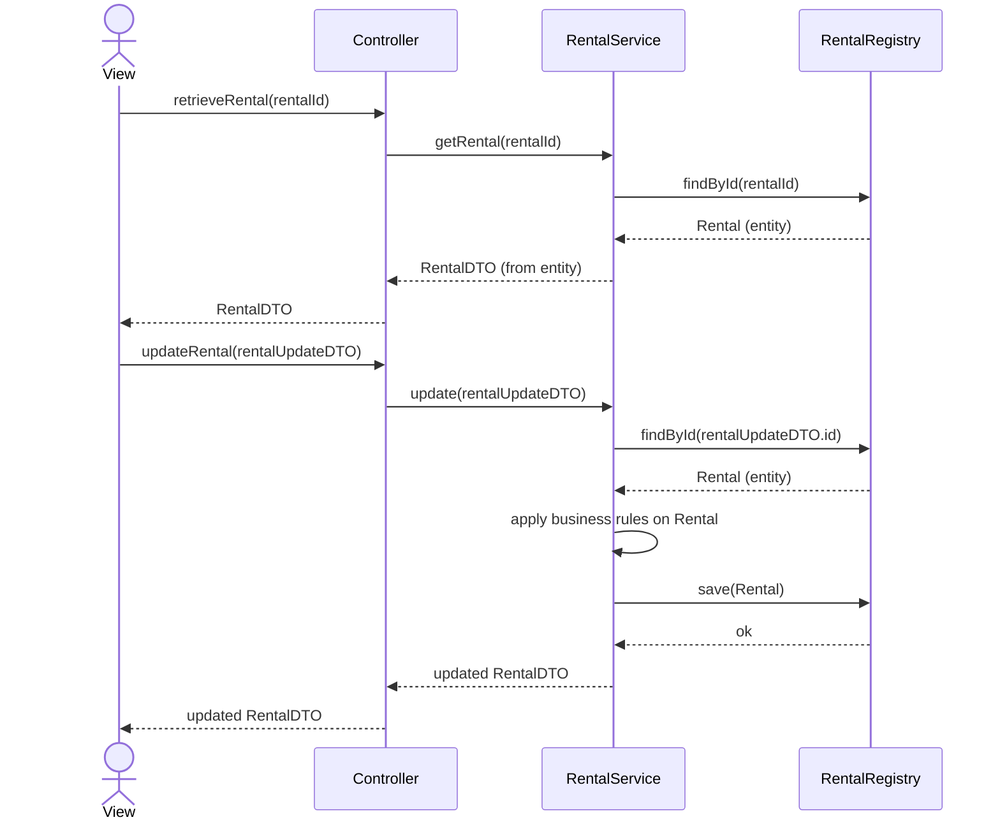

# Chapter 4 Analysis

Domain model (DM) is performed by UML class diagram

System sequence diagram is performed by UML sequence diagram

## 4.1 Domain Model

> “The domain model represents real‑world entities, not program classes.”

A **UML class diagram** is used to construct the **domain model**, but the elements in the DM represent things that exist in reality, not **classes** in an object oriented program. Therefore, it might be better to call them **entities** instead of classes.

The DM is a very good tool for discussions about the program that is being developed. It can ensure that all parties (**developers**, **clients**, **users**, etc) share a **common view** of the tasks of the program. All parties develop a **common nomenclature**.

The software should be quite similar to the DM to beanappropriate model of the reality. This will also make sure that **class names** in the software means something to domain experts.

The black triangular arrow in figure 4.2c shows in which direction the class-association class sequence shall be read, it does not tell anything about the association’s direction. It is up to the diagram author to decide if such black triangles shall be used or not. They are most commonly used if class-association-class shall be read from **right to left, or bottom up**.

### Step 1, Use Noun Identification to Find Class Candidates

It is also far more problematic to have **too few classes**, since it is much easier to cancel existing classes than to f ind new ones.

### Step 2, Use a Category List to Find More Class Candidates

### Step 3, Choose Which Class Candidates to Keep
Therefore, if it is really unclear if a class shall be removed or not, **just let it stay**, at least for now.

**Class Program** is removed. The unexperienced developer easily falls into the trap of modeling the program, instead of the reality, if the class Program is present.

### Step 4, Decide Which Classes Fit Better as Attributes

A simple, but very useful, guideline is that an attribute is a **string**, **number**, **time** or **boolean** value. A class that contain just one such value is a strong candidate to become an attribute.

Another important rule is that an attribute can **not have an attribute**.

A third rule is that when it is hard to decide if something is an attribute or a class, let it **remain a class**. Better to have too many classes than too few.

----

* telephone number -> class: cc, ac, sn (telephoneNumberDTO)?

* email address -> class: username@domainname / string?

* name -> string ~~class: first name, middle name and family name~~ Unless it is relevant to split it into first name and last name, it can be an attribute of Customer. It can also be an attribute of Receptionist and Technician, if needed

* bike brand -> enum class / string?

* bike model -> enum class / string?

* Cost is a number, and could become an attribute of ProposedRepairTask. But then what about **Currency**? Is that not a string that should be an attribute of Amount? This is something that should be discussed with the customer, but now let’s just decide we do not need to keep track of currencies. Therefore, **Currency is removed (currency is SEK by default)** and Amount becomes attribute of ProposedRepairTask, and it is same as totalCost, which is the attribute of RepairOrder.

----

### Step 5, Add Associations

----
* The association **Customer takes Receipt** just tells what the customer is doing. Try to **avoid associations telling what users do**, that is instead showed in the **System Sequence Diagram**, which is explained in the next section.
=>
So the association between **Receptionist** and **RepairOrder** should be removed, similar as the association between **Technician** and **ProposedRepairTask**

* The class **Address has no association**. This is OK for classes that exist just to group data, and do not have a specific meaning but are used in many places.
=> class **Date**, class **RepairOrderState**, class **TelephoneNumber** and so on.

----
### Step 6, Anything To Change?

## 4.3 System Sequence Diagram

Strictly speaking, creating an SSD is not part of the analysis, but instead belongs to **gathering requirements**. Here, we consider it under the analysis section since it is a preparation for program construction.

While the domain model is very much a matter of discussion, the SSD is **more straight forward** to create. It shall reflect the interactions of the requirements specification, **no less and no more**.

1. The customer arrives and asks to rent a car.
2. The customer describes the desired car.

Bullets one and two do not contain any interaction between the actor (cashier) and the system. Remember that it is completely uninteresting for the SSD what happens “outside” the actor. Therefore, **it would be wrong to include the customer**.

3. The cashier registers the customer’s wishes.
4. The program tells that such a car is available.

In bullet three, there is an interaction that shall be included. A system operation shall have a name that starts with a verb, and describes what is done. The system operation in bullet three can be named **searchMatchingCar**.

----
System operations:

13. Technician asks system for repair order.
14. System presents repair order.
15. Technician performs diagnostic.
16. Technician enters diagnostic report and proposed repair tasks.
17. System updates repair order, by adding diagnostic report and proposed repair tasks.

* How to get the repair order from system? RepairOrderId? How to store all of repair orders in RepairOrderRegistry? List<id:string, RepairOrder>

System <-- getRepairOrder(RepairOrderId)-- Technician

System --  foundRepairOrder -------------> Technician

System <-- createDiagnosticReport(foundRepairOrder, diagnosticDescription) -- Technician

System --- createConfirmed --------------> Technician

loop [moreProposedRepairTask]

System <-- createProposedRepairTask(foundRepairOrder, proposedRepairTaskDescription) -- Technician

System --- createConfirmed --------------> Technician

----

# Chapter 5 Design

## 5.2 Design Concepts

### Encapsulation

* **visibility**: public / private, static, final (it is safest to consider the final modifier to be part of the public interface because the final value could not be changed.)  

### High Cohesion

The goal is that a class shall represent **one single** abstraction, which is clearly identified by the class name. Furthermore, the class shall **have knowledge** about that abstraction, **not about anything else**, and perform tasks related to that abstraction, not to anything else.

----
* TelephoneNumber is taken from Customer.
* Bike also

----

### Low Coupling

Low coupling means there are as **few dependencies** as possible in the program. It is not possible to tell a maximum al lowed number, what matters is that there are no dependencies which are not required.

----
* RepairOrder -> DiagnosticOrder -> ProposedRepairTask && RepairOrder -> ProposedRepairTask
* RepairOrder -> Customer -> Bike && RepairOrder -> Bike

----

## 5.3 Architecture

The MVC(Model-View-Controller) Architectural Pattern

Controller: + systemOperation1() ...

As an example, consider the **main** method. Its task is to **start** the program, which is not related to any layer mentioned so far. Therefore, yet a new layer must be introduced, whose responsibility is to start the application.

Note that some layers have a particularly close relation.

* controller layer -> model layer (As a consequence, model shall only be called by controller and never by any other layer)
* dbhandler layer -> database layer (data shall only be called by dbhandlerandnever by any other layer)
* controller layer -> dbhandler layer (Apart from this, layers may be bypassed. It is for example perfectly fine to call dbhandler directly from controller, instead of going via model.)

The **DTO** (Data Transfer Object) Design Pattern:  a long parameter list means a large public interface, and thereby a big risk that it is changed.

A DTO, on the other hand, is read-only, it has **only get methods**. This means it is **immutable**, none of its fields can ever change value. Also, since it can’t change state, it has no history. It’s just **a snapshot** of what something looked like at a particular instance in time.

----
Customer -> Bike vs CustomerDTO -> BikeDTO

----

## 5.4 A Design Method

1. **Use the patterns MVC and layer**. This means to create one package for each layer
2. **Design one system operation at a time**. When creating the design, use **interaction diagrams**. **Do not use a class diagram**, which has no notion of time or execution flow. Whether to use sequence or communication diagrams is a matter of taste.
3. **Strive for high cohesion, low coupling, and a high degree of encapsulation with a small, well-defined public interface**. 
   * ***The domain model*** helps to find new classes that can be introduced. If the ***DM*** is changed, all involved parties must agree on that change.
   * When designing, **favor objects over primitive data** and **avoid static members**, since neither primitive data nor static members are object oriented. When using these, the entire object concept is completely ignored, and the prime tool (objects) to handle encapsula tion, cohesion and coupling is thrown away.
4. **Maintain a class diagram**. Such a diagram tends to become very big and messy, it is permitted to omit parts to make the diagram clearer. If that is done, it should be clearly specified
5. **Implement the new design in code**.

## 5.5 Designing the RentCar Case Study
1. Step 1, Use the Patterns MVC and Layer, the design looks as in ***figure 5.24***.
2. Step 2, Design One System Operation at a Time,
   * The view is not designed here, instead the view package contains a single class, View, which is a placeholder for a real view, that certainly would consist of more classes.
   * The system operations are designed in the order they are executed according to the SSD, ***figure 5.22***.
   * The first operation in the SSD is searchMatchingCar. The first step is to create an **interaction diagram**. 
3. Step 3, Strive for encapsulation with a small, well-defined public interface, high cohesion and low coupling
   * The question, which is the type of the parameter searchedCar and the return value foundCar, is the first of a large number of design decisions. The answer shall be guided by the concepts encapsulation, cohesion and coupling. -> **both a DTO and an entity?** searchedCarDTO only getter methods without business logic, located in dbhandler layer.
   * The fact that the **same name** is used implies that it is in fact the very same object in all three places, which is important information for the reader.
   * Data can **not appear out of nothing**, since searchedCar is a parameter in method call two, it must be clear from where this object comes.
   *  For now, we just choose the simplest solution, namely to let Car be a **DTO**, place it in dbhandler, and not add an entity. This decision might have to be changed later.
   *  Here instead, since there is no database, CarRegistry will just look in **an array** of available cars.
   *  Figure 5.27 Call to dbhandler layer is added. (loop is not part of program, just decided by casher)
   *  Figure 5.28 The start sequence in the main method.
4. Step 4, Maintain a Class Diagram With All Classes.  Note that it is **not mandatory** to include all attributes, methods and references if they do not add any important information, but only obscure the diagram. For example, it is common not to include references to **DTOs**, since they are used in many different layers and are considered as data types.
5. Before leaving searchMatchingCar, we **evaluate** it according to the criteria encapsula tion, cohesion and coupling.
   * Encapsulation
     * All methods in searchMatchingCar are public ― not ideal but acceptable early in design.
     * Public methods are necessary because layers must communicate and the system still has few methods.
     * All fields are private, which is considered good encapsulation practice.
   * Cohesion
     * Each class performs exactly its intended responsibility:
       * Main: starts the program.
       * View: delegates calls to the controller.
       * Controller: executes a system operation that triggers the search in CarRegistry.
       * CarRegistry: contains only the search method.
       * CarDTO: contains no methods (pure data holder).
   * Coupling
     * Dependencies follow the expected layer structure: View → Controller → DBHandler.
     * This unidirectional dependency chain matches the layer pattern design.
     * Main is allowed to depend on classes in other layers because its role is to initialize the system.
     * Coupling in Main is low since it references only one class per layer.
     * Excessive references within the same layer would indicate too high coupling, but that is not the case here.
     * Overall cohesion is high: every class focuses on one task.

## 5.6 Another system operations
### Notes
Note that the CarRegistry method that marks the car as being booked is called **setStateOfBookedCar**, and not bookCar. The reason is that booking the car is business logic, which belongs in the model.

It is a quite interesting decision to **let Rental**, instead of Controller **call setStateOfBookedCar**. The motive is that the controller should not have detailed knowledge about all details of all system operations. That would lead towards spider-in-the-web design, with the controller as spider.

Main creates two objects in the dbhandler layer. This is a warning sign that it might be getting unnecessarily high coupling to that layer. Also, the dbhandler layer might have a bit bad encapsulation, since it has to reveal the existence of CarRegistry and RentalRegistry to main. These problems can be solved by changing that startup design to the one in figure 5.35, where the class **RegistryCreator** is responsible for creating the registries, thus hiding their existence to main.

The design class diagram, figure 5.36, is now becoming quite big. In order to reduce it, the **DTOs are omitted**. Another option would have been to **split it into more, smaller diagrams**. 

Generally, it is a bit dangerous to force an **amount** to have a specific primitive type. For ex ample it is not clear whether an amount can have decimals or not. By introducing the **Amount class**, the primitive type of the amount is encapsulated inside that class, and can thus easily be changed.

**CashPayment class**: Figure 5.38 Payment and CashRegister handling the pay system operation. (With both Amount and CashPayment classes, think about class Cost in assignment).

printer page 87-88 -> create a new layer or to extend (and rename) dbhandler to handle interaction with any other system, so far databases and printers. -> **intergation**

Let’s not include **Printer** in RegistryCreator, since, after all, a printer connection is completely different from a database connection. The RegistryCreator will be responsible only for connecting to the database. -> ***Figure 5.40 The complete startup design.***

Page 89, Figure 5.40: Why is the CashRegister object created by Controller, when all other objects are created by main and sent to Controller? This is a **trade-off** between two contradicting arguments. On one hand, coupling is lowered if main is not associated to all other objects created during startup. On the other hand, cohesion of the Controller constructor is increased if it does not create loads of other objects, besides controller.

### Evaluate the Completed RentCar Design page 89
* **Encapsulation**
  * No method, class, package, or layer currently has *lowerable* visibility — everything that is public must be public for now.
  * However, the design still exposes many public methods, which is **not ideal** for good encapsulation.
  * Adjusting responsibilities can reduce public exposure — e.g., moving operations from Controller into lower layers. (*when saving to db, it should be done in the module, instead of controller*)

* **Coupling**
  * Coupling is relatively high:
    * **Controller is associated with nearly all classes in the model and integration layers.**
  * This could be improved if:
    * Model objects collaborated directly with each other. (*Controller only knows RepairOrder, no idea about DiagnosticOrder or ProposedRepairTask*)
    * Model objects called integration classes without always going through Controller.
  * Example improvement:
    * Change `Receipt getReceipt()` in `Rental` to `void printReceipt(Printer printer)`.
    * Move the printer call from **Controller → Rental**, so Rental handles its own printing.
  * Benefits of this change:
    * Removes Controller → Receipt dependency.
    * Removes Controller → Printer dependency.
    * Allows Receipt constructor to become **package‑private**.
    * Overall reduced coupling and improved layering.
  * Further possible refinements:
    * Let `CashPayment` call `CashRegister` (or vice versa), removing another Controller dependency.
  * Current design is acceptable but can still evolve toward lower coupling.

* **Cohesion**
  * No issues detected.
  * All layers, classes, and methods perform their intended purposes and **nothing more**.
  * Cohesion is considered **good** throughout the design.

Page 90: RetalRegistry: saveRental(Rental)? Maybe saveRental(RentalDTO) is better? No, keep Rental. To controller, it could call some key module in module layer and call registry for data retrieve or saving.

## Common mistakes
1. **Spider‑in‑the‑web class**
   *   A central class (often the Controller) becomes overly connected to many peripheral classes.
   *   Fix by reducing its associations and letting peripheral classes communicate directly.
   *   Example: redesigning receipt printing to remove unnecessary Controller links.
2. **Too much primitive data**
   *   Excessive use of primitive parameters instead of proper objects.
   *   Long parameter lists or many attributes suggest missing abstractions.
   *   Using primitives weakens encapsulation, cohesion, and coupling control.
3. **Unwarranted static methods or fields**
   *   Static members should only exist for strong, justified reasons.
   *   Static data/methods are not tied to objects → reduces ability to use OO principles effectively.
4. **Too few classes**
   *   A model with only one or very few classes often has poor cohesion.
   *   Each class should represent one responsibility; too few classes suggests overloaded classes.
5. **Too few layers**
   *   A missing layer (View, Controller, Model, Startup, Integration) requires justification.
   *   Names may vary, but their *roles* must exist.
   *   Missing layers makes responsibility separation unclear.
6. **Too few methods**
   *   Even if existing methods have high cohesion, some required system tasks may simply be missing.
   *   If functionality isn’t implemented, new methods must be added.
7. MVC or Layered Architecture used incorrectly**
   *   **No I/O outside the View**.
   *   **Model must not call databases or external systems**.
   *   **Integration layer must only call external systems (no business logic)**.
   *   **Calls must always flow from higher layers → lower layers**.
8. **Data appears out of nothing**
   *   Designs must be implementable: a method cannot be called with parameters the caller cannot possibly know.
   *   Example: a controller method needing `paidAmt` even though the View never provides it.
9. **Calling an object without a reference**
   *   An object must have a reference to another before making a call to it.
   *   The design must show how the reference was obtained.
   *   Example: an object attempting to call a method on another object it never received.
10. **Wrong message numbering**
    *   Message numbers must follow dot‑notation:
        *   Call 1 → calls 1.1 → calls 1.1.1, etc.
    *   Using sequential unrelated numbers (1, 2, 3, 4) suggests unclear causality.
11. **Objects not named when required**
   *   Any object appearing more than once in a communication diagram needs a name.
    *   Without a name, it is unclear that multiple appearances refer to the same instance.
12. **Wrong return type**
   *   Common mistake: making Controller methods `void` when they should return data to the View.
13. **Erroneous constructor**
   *   Constructor must:
       *   Have the same name as the class.
       *   Return the class type.
       *   Have the «create» stereotype in design diagrams.
14. **Too large class diagram**
    *   Can become unreadable if overly detailed or too condensed.
    *   Solutions:
        *   Split into multiple smaller diagrams.
        *   Remove unnecessary details (e.g., DTOs, private members).
    *   Full class design must still exist somewhere for coding.
15. **Too large communication diagram**
   *   Becomes messy when:
       *   Too many system operations are included.
       *   Too many alternative flows are shown at once.
    *   Solution: split into multiple diagrams for clarity.

# Questions

## Page 83-84: Please carefully read the chapter 5 design in the attached object-oriented-development.pdf, and answer my question follow the attached pdf taste and principle:

If I have the system operations to retrieve the rental and update the rental. To the system operation "retrieve the rental", the object of class RentalDTO would be retrieved from RentalRegistry, the attributes of this RentalDTO could not be changed in the view layer. If I want to continue the next system operation "Update the rental", should I create a new class Rental in the module layer? If yes, is it redundant of both RentalDTO and Rental?

Great question, Sanders — and you’re asking it exactly the way **Chapter 5 (Design)** wants you to: from the perspective of **MVC + Layers**, **DTO vs Entity**, **immutability**, **cohesion/coupling**, and **where business logic lives**.

Below is a crisp answer in the book’s “taste and principle”, with short citations to the attached PDF.

***

## Short answer

**Yes, you should have both a `Rental` (entity) and a `RentalDTO` (data transfer object).**\
They are **not redundant**: they serve **different purposes** in the architecture.

*   **`RentalDTO`**: an **immutable snapshot** used only to **transfer data across layers** (e.g., controller ⇄ view). It carries values and **no business logic**; view must not mutate it. [\[object-ori...evelopment | PDF\]](https://ericsson-my.sharepoint.com/personal/sanders_wang_ericsson_com/Documents/jobs/RADIO_RTI/MyCCode/ood/object-oriented-development.pdf)
*   **`Rental`**: a **model entity** that **encapsulates business rules and state changes** for a rental (approve/reject/update tasks, etc.). Updates must be made **on this entity**, not on the DTO. [\[object-ori...evelopment | PDF\]](https://ericsson-my.sharepoint.com/personal/sanders_wang_ericsson_com/Documents/jobs/RADIO_RTI/MyCCode/ood/object-oriented-development.pdf)

***

## Why both are needed (per Chapter 5)

1.  **DTO pattern purpose**\
    Chapter 5 introduces DTOs to **avoid long parameter lists**, keep the **public interface small and stable**, and **pass data through layers**. A DTO is a “just data container”, typically **read‑only/immutable**, and **exists only to carry data between layers**. The book explicitly distinguishes DTOs from entities: DTOs are **equal when all attributes are equal**, have **only getters**, and **no history**; entities have identity and **can change state**. [\[object-ori...evelopment | PDF\]](https://ericsson-my.sharepoint.com/personal/sanders_wang_ericsson_com/Documents/jobs/RADIO_RTI/MyCCode/ood/object-oriented-development.pdf)

2.  **Where logic belongs**\
    Business logic must live in **Model**, never in the integration layer or view. In the car‑rental case study, the book adds a `Rental` entity to **represent the whole rental transaction**, keep references to related objects, and perform actions like **approve/reject/print receipt** (after refactoring) — i.e., **methods that change state and enforce rules**. [\[object-ori...evelopment | PDF\]](https://ericsson-my.sharepoint.com/personal/sanders_wang_ericsson_com/Documents/jobs/RADIO_RTI/MyCCode/ood/object-oriented-development.pdf)

3.  **Immutability at the boundaries**\
    The text stresses making DTOs **immutable** precisely to prevent the view (or other layers) from changing them after passing them downstream. That is exactly your situation: the `RentalDTO` you “retrieve” for the view **shall not be mutated** in the view; instead, the next operation (“Update the rental”) must be expressed as **new input** that the controller sends to the model, which then updates the **`Rental` entity**. [\[object-ori...evelopment | PDF\]](https://ericsson-my.sharepoint.com/personal/sanders_wang_ericsson_com/Documents/jobs/RADIO_RTI/MyCCode/ood/object-oriented-development.pdf)

4.  **Avoid spider‑in‑the‑web controllers**\
    Chapter 5 warns against controllers that do all work. Your **update** operation should **delegate** to model services/entities, and those can talk to integration (`RentalRegistry`) to load/persist. This keeps cohesion high and coupling low. [\[object-ori...evelopment | PDF\]](https://ericsson-my.sharepoint.com/personal/sanders_wang_ericsson_com/Documents/jobs/RADIO_RTI/MyCCode/ood/object-oriented-development.pdf)

***

## How to flow the two operations (per book’s style)

### 1) **retrieveRental(rentalId) → RentalDTO**

*   **Controller** receives `rentalId`.
*   **Model service** loads the **`Rental` entity** from **`RentalRegistry`** (integration).
*   Convert the entity to **`RentalDTO`** and return to **Controller → View**.\
    *DTO is immutable and cannot be changed in the view.* [\[object-ori...evelopment | PDF\]](https://ericsson-my.sharepoint.com/personal/sanders_wang_ericsson_com/Documents/jobs/RADIO_RTI/MyCCode/ood/object-oriented-development.pdf)

### 2) **updateRental(rentalUpdateDTO)** (or a small set of verb‑first operations)

*   **View** constructs a **new DTO** describing the requested changes (e.g., updated tasks/diagnostic/state).\
    (The book prefers passing an **object parameter** rather than many primitives.) [\[object-ori...evelopment | PDF\]](https://ericsson-my.sharepoint.com/personal/sanders_wang_ericsson_com/Documents/jobs/RADIO_RTI/MyCCode/ood/object-oriented-development.pdf)
*   **Controller** calls **Model**: load **`Rental`** by id → call **behavioral methods** on the entity (`updateDiagnostic(...)`, `addTask(...)`, `approve()`, `reject()`, etc.).
*   **Model** persists via **`RentalRegistry`**, and if needed, returns a **fresh `RentalDTO` snapshot**. [\[object-ori...evelopment | PDF\]](https://ericsson-my.sharepoint.com/personal/sanders_wang_ericsson_com/Documents/jobs/RADIO_RTI/MyCCode/ood/object-oriented-development.pdf)

> **Key point:** you **never mutate `RentalDTO`**; you **apply changes to `Rental`** and emit a **new snapshot DTO** after the update. This mirrors the book’s treatment of `CarDTO` vs. `Rental`/services and its insistence on **immutable DTOs** and **business logic in entities/services**. [\[object-ori...evelopment | PDF\]](https://ericsson-my.sharepoint.com/personal/sanders_wang_ericsson_com/Documents/jobs/RADIO_RTI/MyCCode/ood/object-oriented-development.pdf)

***

## Is having both “redundant”?

**No.** Even if some fields look identical, **their responsibilities differ**:

*   **`RentalDTO`** = *representation for transfer* (stable shape, read‑only, no rules).
*   **`Rental`** = *domain object with identity + rules + state transitions* (logic lives here).

The book explicitly discusses this confusion using the car‑rental example: sometimes early designs start with just a DTO, but as soon as **business logic or identity** appears, you **introduce/keep the entity**. It even shows where they **first treated `Car` as `CarDTO`** for simplicity, then brought in **entities and registries** as design matured. Same principle applies to `Rental`. [\[object-ori...evelopment | PDF\]](https://ericsson-my.sharepoint.com/personal/sanders_wang_ericsson_com/Documents/jobs/RADIO_RTI/MyCCode/ood/object-oriented-development.pdf)

***

## Common pitfalls to avoid (book’s “NO!” spirit)

*   **Don’t put logic into `RentalDTO`** (e.g., `matches(...)` or `approve()` inside DTO). That’s a **common mistake** highlighted in the case study: **DTOs are not to contain business logic**. [\[object-ori...evelopment | PDF\]](https://ericsson-my.sharepoint.com/personal/sanders_wang_ericsson_com/Documents/jobs/RADIO_RTI/MyCCode/ood/object-oriented-development.pdf)
*   **Don’t let Controller become spider‑in‑the‑web.** Move detail work to **`Rental`** or **model services**, and let entities call integration as needed (like the book’s refactoring that moved printing from controller to `Rental`). [\[object-ori...evelopment | PDF\]](https://ericsson-my.sharepoint.com/personal/sanders_wang_ericsson_com/Documents/jobs/RADIO_RTI/MyCCode/ood/object-oriented-development.pdf)
*   **Don’t mutate DTOs in the view.** Make them **final/immutable**. Create a **new DTO** for each request or return value. [\[object-ori...evelopment | PDF\]](https://ericsson-my.sharepoint.com/personal/sanders_wang_ericsson_com/Documents/jobs/RADIO_RTI/MyCCode/ood/object-oriented-development.pdf)
*   **Don’t mix layers.** Integration (`RentalRegistry`) should **persist/fetch**, not implement business rules; **Model** should **enforce rules**; **View** should only present/collect. [\[object-ori...evelopment | PDF\]](https://ericsson-my.sharepoint.com/personal/sanders_wang_ericsson_com/Documents/jobs/RADIO_RTI/MyCCode/ood/object-oriented-development.pdf)

***

## Optional: minimal interaction sketch (book-compliant)

*(Controller thin; DTO round-trips; entity handles rules; integration persists) — exactly as Chapter 5 recommends.* [\[object-ori...evelopment | PDF\]](https://ericsson-my.sharepoint.com/personal/sanders_wang_ericsson_com/Documents/jobs/RADIO_RTI/MyCCode/ood/object-oriented-development.pdf)

***

## Conclusion

*   Keep **`RentalDTO`** for **data transfer** (immutable).
*   Keep/introduce **`Rental`** for **business behavior and state**.
*   Drive updates by **calling behavior on the entity**, then **map back** to a new DTO.\
    This is the clean, **non‑redundant** design the book teaches throughout Chapter 5 and the car‑rental case study. [\[object-ori...evelopment | PDF\]](https://ericsson-my.sharepoint.com/personal/sanders_wang_ericsson_com/Documents/jobs/RADIO_RTI/MyCCode/ood/object-oriented-development.pdf)

If you’d like, I can sketch the **package layout** (controller/model/integration) and a **tiny DTO↔entity assembler** the book implicitly relies on, still in the same style.

https://docs.github.com/en/get-started/writing-on-github/getting-started-with-writing-and-formatting-on-github/basic-writing-and-formatting-syntax

----
* TelephoneNumber: in view it is string as argument of searchCustomer(telephoneNumber:string), in model layer class TelephoneNumber to convert string to E164 international format for id in CustomerRegistry.
* module layer: RepairOrder, DiagnosticOrder, ProposedRepairTask.
* intergration layer: CustomerRegistry (function: retrieveCustomer; class: CustomerDTO, BikeDTO), RepairOrderRegistry (function: saveRepairOrder, retrieveRepairOrder???)

Questions:
1. The object retrieved from registry is DTO or entity? If it is entity with logic business, the view could directly call the functions to handle?

----